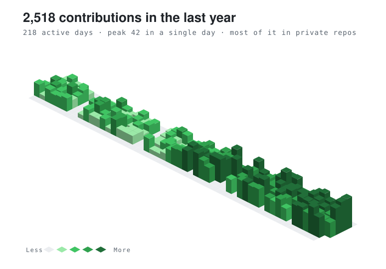

> [!NOTE]
> **Branch de preview — não é o perfil.** A `main` está intacta, então github.com/luana-barbosa
> continua igual. Aqui estão as duas opções de topo lado a lado e o corpo novo do README.
> Depois de escolher, isso vira um README limpo (só a opção escolhida) e vai pra `main`.

 

# OPÇÃO A — banner próprio

<picture>
  <source media="(prefers-color-scheme: dark)" srcset="assets/banner-dark.svg">
  
</picture>

Arquivo seu, no seu repo. Troca sozinho entre tema claro e escuro. Nenhum serviço de terceiro
no caminho — não tem como quebrar.

  

# OPÇÃO B — contribuição isométrica

<picture>
  <source media="(prefers-color-scheme: dark)" srcset="assets/contrib-3d-dark.svg">
  
</picture>

Seus dados reais: 2.518 contribuições, 218 dias ativos, pico de 42 num dia. Repare que ele
cresce da esquerda pra direita — sua atividade acelerou nos últimos meses, e isso aparece de graça.
Se você escolher essa, eu configuro um GitHub Action pra regerar o SVG toda semana.

 

---

 

# ↓ o corpo do README (vale pras duas opções)

 

### Android engineer, risk side.

I build the part of a fintech app that decides whether you're really you — liveness and biometric
checks, device-bound certificates, and the fraud signals underneath.

Too strict, and someone real can't open their account. Too loose, and someone else spends their
money. Most of my work lives in that gap.

The other half is knowing which of the two is happening: instrumentation, dashboards, alerts — and
lately, AI agents that read our own services and answer questions about them, with the source code
as the only thing allowed to settle an argument.

**Kotlin** by trade · **Python** when the tooling needs it · Brazilian, based in Spain.

  
  

 

### Stack

**Mobile**

**Plataforma & dados**

**Observabilidade & IA**

  
  
  
  
  
  

 

### Currently

- Building agents that map internal services and answer questions about them, code-first
- Mobile engineering metrics — making "is the app healthy?" a question with an actual answer
- Incident response with AI in the loop

 

---

Sobre a cobrinha antiga: o SVG apontava pra <code>beatriznonato/beatriznonato@output</code> —
o grafo de contribuição de outra pessoa. Além de não ser seu, quebraria no dia em que aquela branch
saísse do ar.
