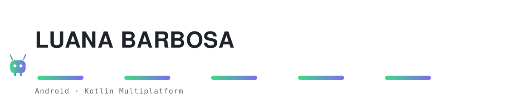

<picture>
  <source media="(prefers-color-scheme: dark)" srcset="assets/hero-dark.svg">
  
</picture>

### Mobile engineer · Android, Kotlin Multiplatform

I move production journeys to Kotlin Multiplatform: shared domain and data, native integration on
both the Android and the iOS side, shipped behind flags, legacy deleted once it's stable. Small
incremental PRs, Maestro suites green at every step.

The part I like most isn't the migration itself. It's turning it into something repeatable: a
pattern the next person can follow without asking me, and a rollout doc that puts the queue in
order of effort instead of in order of opinion.

And when a manual process shows up often enough, I build the bot that does it. Workflow
automations, triage, and CI so the tool itself doesn't rot.

**Kotlin** · **KMP** · **Swift** on the iOS side · **Python** for tooling

  
  

### Stack

  
  
  

