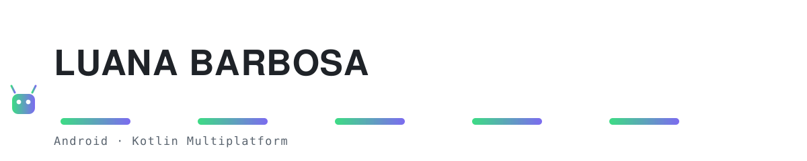

> [!NOTE]
> **Branch de preview, não é o perfil.** A `main` está intacta. As quatro animações abaixo rodam
> sozinhas em loop nesta página. Escolha uma e eu monto o README final só com ela.

 

## 1. Cobrinha sua

<picture>
  <source media="(prefers-color-scheme: dark)" srcset="assets/top-snake-dark.svg">
  
</picture>

Ela atravessa comendo os blocos, cresce a cada bloco, e o nome acende no rastro. Loop de 6s.
É a cobrinha que você gostava, só que sua: a de hoje puxa o SVG do repositório de outra pessoa.

 

## 2. Terminal rodando o build

<picture>
  <source media="(prefers-color-scheme: dark)" srcset="assets/top-terminal-dark.svg">
  
</picture>

Digita o comando sozinho, compila pros dois targets, passa o Maestro e fecha com BUILD
SUCCESSFUL. Diz a stack inteira sem listar tecnologia nenhuma. Loop de 7,5s.

 

## 3. Robozinho pulando

<picture>
  <source media="(prefers-color-scheme: dark)" srcset="assets/top-robot-dark.svg">
  
</picture>

Salta de plataforma em plataforma e cada pouso acende um pedaço do nome. O mais brincalhão dos
quatro. Loop de 6s.

 

## 4. Um código, dois telefones

<picture>
  <source media="(prefers-color-scheme: dark)" srcset="assets/top-phones-dark.svg">
  
</picture>

O bloco `kt` do meio pulsa e dispara partículas pros dois lados, e a mesma tela nasce junto no
Android e no iOS. É literalmente o seu trabalho virando animação. Loop de 4,2s.

 

---

 

# corpo do README (esse você aprovou)

 

### Mobile engineer · Android, Kotlin Multiplatform

I move production journeys to Kotlin Multiplatform: shared domain and data, native integration on
both the Android and the iOS side, shipped behind flags, legacy deleted once it's stable. Small
incremental PRs, Maestro suites green at every step.

The part I like most isn't the migration itself. It's turning it into something repeatable: a
pattern the next person can follow without asking me, and a rollout doc that puts the queue in
order of effort instead of in order of opinion.

And when a manual process shows up often enough, I build the bot that does it. Workflow
automations, triage, and CI so the tool itself doesn't rot.

**Kotlin** · **KMP** · **Swift** on the iOS side · **Python** for tooling

  
  

 

### Stack

  
  
  

